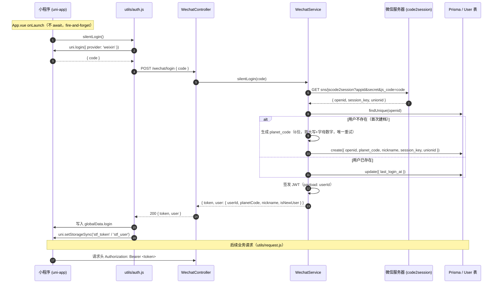

## Context

当前项目由两部分组成：后端 `send-to-future-nest`（NestJS + Prisma + PostgreSQL）与微信小程序 `send-to-future`（uni-app 编译到 mp-weixin）。现状是：

- 后端已有 `User` 模型（字段 `user_id`/`planet_code`/`nickname`/`planet_type`/`palette_id`/`listeners_count`/时间字段），但没有任何微信身份来源；`planet_code` 为唯一且**无默认值**，意味着新用户建档时必须主动生成。
- 小程序侧所有行为（写信、发射、星球坐标、订阅）都是匿名本地状态（`globalData` + `setStorageSync`），没有登录态，也没有任何访问后端的网络封装。
- 后端已集成 `PrismaModule`、`ConfigModule`（`NODE_ENV` 选择 `.env.development`/`.env.production`），`main.ts` 仅 `listen`，尚未开启 CORS。

本次要为「进入小程序即静默登录」提供端到端支撑：小程序启动第一时间拿 `code` → 后端 `code2session` 换 `openid` → 以 `openid` upsert 用户 → 返回令牌建立身份。

## Goals / Non-Goals

**Goals:**

- 后端提供稳定的微信登录接口并完成用户建档/识别。
- 小程序在 `onLaunch` 无感知完成登录，登录态可持久化、可被后续请求复用。
- 在 `User` 表上以最小侵入扩展微信身份字段。

**Non-Goals:**
- 不做「授权登录」（获取手机号、头像昵称的用户信息授权弹窗）。仅静默 `uni.login({ provider: 'weixin' })`。
- 不做多端（支付宝/百度）登录，仅微信小程序。
- 不做基于角色/权限的复杂鉴权体系，仅做身份识别令牌。
- 不迁移或破坏现有 13 张表的其他结构与数据。

## Decisions

1. **登录接口契约**：`POST /wechat/login`，请求体 `{ "code": string }`，成功返回
   `{ token, user: { userId, planetCode, nickname, isNewUser } }`。
   选择独立前缀 `/wechat` 而非放进通用 `/auth`，因为后续可能区分微信/其他渠道。
   - 替代方案：放进 `AppController`。否决：登录是独立领域，单独 `WechatModule` 更清晰、可测试。

2. **身份令牌用 JWT（无状态）**：后端签发 JWT，payload 含 `userId`（与 `openid` 隐含绑定）。
   选择 JWT 而非自建 session 表：本系统暂无分布式会话需求，JWT 无需存储、易随请求头传递。
   - 替代方案：返回 `openid` 明文作为用户标识。否决：明文 `openid` 可被伪造，JWT 签名可防篡改。

3. **调用微信 `code2session`**：在 `WechatService` 内通过 `@nestjs/axios` 的 `HttpService` 请求
   `https://api.weixin.qq.com/sns/jscode2session?appid=APPID&secret=SECRET&js_code=CODE&grant_type=authorization_code`。
   选择 `@nestjs/axios` 而非原生 `fetch`：与 Nest 依赖注入、`onModuleInit` 生命周期一致，便于单元测试 mock。
   - 失败处理：微信返回 `errcode != 0` 或网络失败 → 返回 401/400，不建档。

4. **用户 upsert 策略**：以 `openid` 为唯一键。
   - 已存在 → 更新 `last_login_at`。
   - 不存在 → 新建，`openid` 写入，`planet_code` 由服务生成（规则见下），`nickname` 默认 `微信用户{后6位openid}`，`unionid`/`session_key` 落库。
   - `planet_code` 生成规则：6 位 id，字符集为大小写字母与数字 `A-Za-z0-9`，**首位必须为大写字母 `A-Z`**，后 5 位取自完整字符集；生成后校验与库中已有 `planet_code` 不重复，若冲突则重新生成并重试，直到唯一。
   - 替代方案：依赖数据库 `upsert` 一次完成。采用：先 `findUnique` 再 `create`/`update`，便于控制首次建档默认值与 `isNewUser` 标记；`planet_code` 唯一性由「生成器重试 + 数据库 `@unique` 兜底」双重保障。

5. **小程序静默登录时机与方式**：小程序基于 **uni-app**（编译到 mp-weixin），所有微信/网络/存储能力统一使用 uni-app 官方封装 API，不直连 `wx.*`。在 `App.vue` 的 `onLaunch` 中调用 `auth.silentLogin()`，其中通过 `uni.login({ provider: 'weixin' })` 拿 `code`、通过 `uni.request()` 发登录请求、通过 `uni.setStorageSync()` 持久化；并**不 await 阻塞**首屏渲染（fire-and-forget）。结果写入 `globalData.login` 并 `uni.setStorageSync('stf_token'/'stf_user')` 持久化，下次启动优先读取本地令牌避免重复请求。
   - 说明：`uni.login({ provider: 'weixin' })` 在 mp-weixin 平台下就是微信 `wx.login` 的跨端封装，其返回的 `code` 与直接调用 `wx.login` 拿到的是同一个微信登录凭证，因此后端 `code2session` 的入参与逻辑完全不变。之所以统一走 `uni.login` 而非 `wx.login`，是为了保持 uni-app 跨端一致性、便于后续扩展其他平台。

6. **网络与鉴权封装**：新增 `utils/request.js`（基于 `uni.request` 的 Promise 封装，统一 baseURL、自动附带 `Authorization: Bearer <token>`、统一错误提示）与 `utils/auth.js`（`silentLogin()`、`getToken()`、`getUserInfo()`、`isLoggedIn()`）。后端 baseURL 置于 `utils/config.js`，区分 dev/prod。后端 `main.ts` 开启 `CORS`（允许小程序域名/本地调试）。

7. **配置管理**：`WECHAT_APPID`、`WECHAT_SECRET`、`JWT_SECRET` 写入 `.env.development`/`.env.production`（不提交真实密钥，提供 `.env.example` 占位）。经由 `ConfigModule` 注入。

## Sequence Diagram（仅供理解，非实现要求）

下图描述静默登录完整时序，**实现代码时忽略本图**，仅用于阅读梳理参与者与消息流。

## Risks / Trade-offs

- [Risk] 微信 `code` 有效期仅 5 分钟、且一次性：前端需每次启动时重新 `uni.login({ provider: 'weixin' })` 拿新 code。→ 缓解：静默登录本就在启动期执行，天然拿新 code；失败仅影响身份识别，不阻塞业务。
- [Risk] `planet_code` 生成存在极低概率碰撞。→ 缓解：生成器先查库/捕获唯一约束冲突后重试生成新 id（最多重试 20 次，超出则抛错）；数据库 `@unique` 索引兜底，最终保证不重复。
- [Risk] `session_key` 存库若泄露有安全风险。→ 缓解：仅静默登录阶段暂存，`session_key` 不进入 JWT、不透出给前端；后续如需解密用户信息可改为按需缓存。
- [Risk] 后端未在微信后台配置「request 合法域名」会导致真机请求失败。→ 缓解：开发期 `manifest.json` 中 `mp-weixin.setting.urlCheck:false` 已关闭校验；上线前在微信后台配置域名。
- [Trade-off] JWT 无状态无法主动吊销：静默登录场景下用户换设备/清缓存即重新登录，影响可接受。

## Migration Plan

1. 后端：`prisma/schema.prisma` 增加 `User` 字段 → `prisma migrate dev --name add_wechat_fields` 生成迁移 → `prisma generate` 更新客户端。旧用户 `openid` 为空，不影响现有结构与数据。
2. 后端：新增 `wechat` 模块、`JwtModule`、CORS；补充 env 配置；`AppModule` 注册。
3. 小程序：新增 `utils/*` 并修改 `App.vue` 的 `onLaunch`；`manifest.json` 保持 `urlCheck:false` 便于调试。
4. 回滚：移除 `WechatModule` 注册、`onLaunch` 调用即可下线登录链路；数据库迁移可逆（`prisma migrate revert`），新增列可安全保留或删除。

## Open Questions

- 是否需要前端可主动触发「重新登录 / 登出」入口（当前仅静默、无显式登出）？本期默认不提供。
- 是否把 `planet_code` 生成规则统一收敛到一个共享服务（其他建档入口也用到）？本期仅在 `WechatService` 内生成，后续可抽取。
