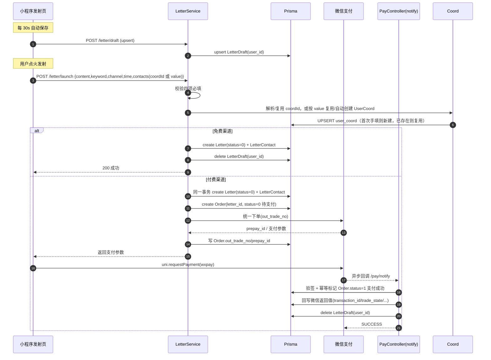

## Context

项目由后端 `send-to-future-nest`（NestJS + Prisma + PostgreSQL）与微信小程序 `send-to-future`（uni-app 编译到 mp-weixin）组成。现状：

- 小程序「发射」页 `pages/launch/launch.vue` 已具备完整 UI：信件内容、关键字、送达方式（mail/qqmail/sms/unbreakable + launchOnly）、送达时间、点火动画；但 `proceedWithLaunch` 只把信件塞进 `globalData.mySentLetters` + `setStorageSync`，**无任何后端落库**，刷新即丢。
- 付费渠道当前是 `simulateWechatPay` 的 setTimeout 假支付，未对接真实微信支付。
- 各渠道联络信息（地址/手机号/邮箱）在 `confirmCoord` 里仅做前端必填校验，未做服务端校验，也未持久化。
- 后端 `Letter` 模型已存在（`status SmallInt default 0`），但文档约定 `0=编写中 / 1=旅行中 / 2=已送达`；草稿迁移到独立表后，`0` 的语义需改为「审核中」。
- 后端已有 `AuthGuard`（白名单放行、其余需 JWT）、`WechatService`（静默登录）、`PrismaService`，基础设施齐备。
- 已落地的 `user-coord-crud` 变更提供 `CoordModule`（`GET/POST/PUT/DELETE /coord`，按 `user_id` 隔离），坐标类型收敛为 `phone`/`email`/`wechat`/`address` 四类并带服务端校验；`UserCoord`（`user_coord` 表）是用户可复用的「数据信息」来源，本次发射的送达联络信息应复用它，而非每次重新手填。

本次目标：把「发射」升级为端到端业务——草稿箱自动保存、发射落库进入审核中、付费渠道真实支付、渠道联络信息收集与服务端校验。

## Goals / Non-Goals

**Goals:**

- 提供草稿箱：用户编写中的信件定时（30s）落库，发射成功后删除，退出不丢。
- 提供发射接口：四项必填校验 + 落库 `status=0 审核中`；付费渠道真实微信支付。
- 各渠道联络信息服务端收集与校验（手写信件地址、牢不可破的誓言地址/手机号/邮箱）。
- 送达联络信息复用 `user-coord-crud` 已建坐标（`UserCoord`），并在用户首次手填手机号/邮箱/地址并保存（发射）时，由后端调用 `CoordService` 自动建档。

**Non-Goals:**

- 不实现「审核后台」：本期只把信件置为审核中，不含人工/自动审核通过与状态流转的具体策略（预留 `status=1/2/3`）。
- 不实现短信/邮件/邮政的实际投递：本期只负责落库与支付，真正送达由后续定时任务处理。
- 不新增「地球坐标」管理页的增删改 UI：仅读取/复用已存坐标，并在发射时按需复用 `CoordService` 自动建档；坐标的增删改仍由 `user-coord-crud` 的 `CoordModule` 负责。
- 不改动现有 13 张表的其他字段与关系。

## Decisions

1. **草稿模型 `LetterDraft`（每用户一份，upsert 语义）**：发射页是单封在写信件，故草稿按 `user_id` 唯一，后端用 upsert「有则更新、无则新建」，前端每 30s 调一次保存接口。相比「每用户多份草稿列表」，单份 upsert 实现简单、与现有单页编辑心智一致。
   - 存储字段：`user_id`(FK)、`mode`、`content`、`keyword`、`channel_code`、`is_public`、`selected_years`、`custom_date`、`from_name`、`to_name`、以及联络信息 `contact_phone`/`contact_email`/`contact_address`/`extra_contacts(Json)`、`update_time`。
   - 发射成功后 `DELETE` 该用户草稿。页面 `onUnload`/销毁时**不**删草稿（保留以续写）。

2. **发射流程区分免费/付费，付费渠道用一对一 `Order` 承接微信支付全链路**：
   - 免费渠道（`qqmail`/`launchOnly`）→ 直接 `POST /letter/launch` 校验后落库 `Letter(status=0)` + `LetterContact`，返回成功。
   - 付费渠道（`mail`/`sms`/`unbreakable`）→ 在**同一事务**内先建 `Letter(status=0 审核中)` + `LetterContact`，再建 **`Order`**（`letter_id` 一对一、`status=0 待支付`）；调用微信支付「统一下单」拿 `prepay_id` 并写入 `Order.out_trade_no`，把支付参数返回前端；前端用 uni-app 官方 `uni.requestPayment`（provider `wxpay`）调起支付；微信异步回调 `POST /pay/notify` → 校验签名、按 `out_trade_no` 幂等标记 **`Order.status=1 支付成功`**，并把微信返回值（以下字段对齐微信支付 V3 交易查询/回调）回写 `Order`：`transaction_id`/`trade_state`/`trade_state_desc`/`trade_type`/`bank_type`/`payer_openid`/`currency`/`payer_total`/`success_time`，再删除草稿。
   - **`Order` 与 `Letter` 一对一**（每封信至多一笔支付订单）：`Order` 在用户发起支付前即创建且状态为「待支付」，支付成功回调后变更为「支付成功」，因此发射即 `Letter.status=0 审核中` 的硬约束与「支付中」状态得以共存，且无需在回调里再建信件（避免孤儿信件）。`Order` 独立承接微信支付「发起→结束」的所有信息，便于审计、查单与退款。
   - **`Order` 字段对齐微信支付 V3 返回值**：下单阶段写 `out_trade_no`/`prepay_id`（及本地 `channel_code`/`amount`）；回调/查单阶段写 `transaction_id`/`trade_type`/`trade_state`/`trade_state_desc`/`bank_type`/`payer_openid`/`currency`/`payer_total`/`success_time`/`attach`，原始报文落 `wx_raw(JSON)`。`status` 本地枚举：`0=待支付 / 1=支付成功 / 2=已关闭|已退款`。

3. **渠道联络信息落到 `LetterContact`**：每封信一条 `LetterContact`（`letter_id` FK），结构化存储 `phone`/`email`/`address`（可空，按渠道必填其一/多），`extra_contacts Json` 存牢不可破誓言的备选联系人。相比把整个 contacts 当 JSON 塞进 `Letter`，结构化字段便于后续投递任务查询与校验。

4. **送达联络信息复用 `UserCoord`（来自 user-coord-crud），首次手填自动建档**：
   - 需要「送达」的渠道（`mail`→`address`、`sms`→`phone`、`unbreakable`→`address`+`phone`+`email`）的联络信息，优先复用用户在 `user-coord-crud` 中已创建的坐标。发射请求体对每个联络字段支持两种提供方式：① 传 `coordId` 引用已存在、归属本人且类型匹配的 `UserCoord`，后端据此解析 `coord_value`；② 传原始 `value`（用户手填新值）。
   - **首次填写自动建档**：当用户以原始 `value` 提交、且该 `value` 在本人同类型坐标中尚不存在时，后端在 `launch` 事务内复用 `CoordService` 的创建逻辑（同一套类型/值校验）写入一条新的 `UserCoord`——即「用户在首次填写手机号/邮箱等信息并点击保存（发射）时，由后端调用 user-coord 模块为其创建对应坐标」，便于下次发射直接选用。
   - 解析出的真实 `value` 仍落库到 `LetterContact.phone/email/address`；`LetterContact` 不新增外键列，坐标与信件通过值关联（坐标可多封信复用、用户可在「地球坐标」页改/删，不影响已发射信件的快照值）。
   - 复用方式：`LetterModule` 导入 `CoordModule` 并复用其导出的 `CoordService`（避免重复校验逻辑）；`CoordModule` 需 `exports: [CoordService]`。前端发射页对每个必填联络字段：进入时 `GET /coord` 拉取该类型坐标列表供选择；选已有坐标→带 `coordId` 提交，手填新值→带 `value` 提交，由后端自动建档。

5. **服务端校验规则（牢不可破的誓言等）**：手机号 `^1[3-9]\d{9}$`（中国大陆 11 位）；邮箱 `^[A-Za-z0-9._%+-]+@[A-Za-z0-9.-]+\.[A-Za-z]{2,}$`（常见邮箱）。校验在 `LetterService` 内统一执行，前端仅做基础即时提示；任一不通过返回 400 且不落库。

6. **`Letter.status` 语义重建（BREAKING）**：草稿迁出后，`Letter.status` 重建为 `0=审核中 / 1=旅行中 / 2=已送达`，预留 `3=审核驳回`。`letter.letter_no` 唯一约束、`sender_id` 关系等保持不变。因无生产数据，仅更新 Prisma 注释与 spec，不写数据迁移脚本。

7. **接口鉴权与契约**：发射/草稿/支付回调均过 `AuthGuard`（非白名单）；`/pay/notify` 需加入白名单（微信回调不带 JWT）。请求统一走 `utils/request.js`（已带 `Authorization: Bearer`）。

8. **微信支付 SDK 选择**：后端引入 `wechatpay-node-v3`（或官方 `wechatpay` 包）处理 V3 接口与回调签名验证；新增 `WECHAT_PAY_MCHID`/`WECHAT_PAY_SERIAL`/`WECHAT_PAY_PRIVATE_KEY`/`WECHAT_PAY_V3KEY`/`WECHAT_PAY_NOTIFY_URL` 等 env。

## Sequence Diagram（仅供理解，非实现要求）

## Risks / Trade-offs

- [Risk] 30s 定时保存可能丢最后一次输入（如 29s 内退出）。→ 缓解：页面 `onUnload`/`onHide` 时额外立即保存一次（best-effort），并接受最多 30s 粒度丢失。
- [Risk] 微信支付回调可能重复/乱序。→ 缓解：`out_trade_no` 幂等，回调内对 `Order` 加「已支付则跳过」判断；落库用事务。
- [Risk] 付费渠道支付中途取消，信件处于「审核中」但订单未支付。→ 缓解：发射即建 `Letter` 与待支付 `Order`，用户可重新发起支付（同一 `Order` 或由新 `Order` 接力）；后续可用定时任务对长期待支付的 `Order` 关单并标记信件，本期仅留 `status=2 已关闭` 枚举位。
- [Risk] 微信支付私钥/证书泄露。→ 缓解：仅服务端持有，写入 env 不入库、不前端下发；`.env.example` 占位。
- [Risk] 首次手填联络信息自动建档可能产生重复/格式不一致的 `UserCoord`（如 `13800138000` 与 `138 0013 8000`）。→ 缓解：建档前先按「同用户 + 同类型 + 归一化值」查重，已存在则不再新建、直接复用；归一化规则与 `CoordService` 校验保持一致。
- [Trade-off] 每用户单份草稿：不支持「多封草稿并行编辑」。→ 当前发射页为单信编辑，可接受；后续可扩展为多草稿列表。
- [Trade-off] `Letter.status` 语义重建为 BREAKING：若已有数据需手动处理。→ 当前无生产数据，约定即生效。

## Migration Plan

1. 后端：`prisma/schema.prisma` 新增 `LetterDraft`、`LetterContact`、`Order` 模型（其中 `Order` 与 `Letter` 一对一、字段对齐微信支付 V3 返回值）并调整 `Letter.status` 注释 → `prisma migrate dev --name letter_launch_and_draft` → `prisma generate`。
2. 后端：新增 `letter` 模块（controller/service）、`pay` 模块（微信支付下单 + 回调），`AppModule` 注册；`.env` 增加微信支付配置；`AUTH_WHITELIST` 增加 `/pay/*`。
3. 小程序：改造 `launch.vue`（30s 草稿保存、发射走接口、`uni.requestPayment`、地址回填与必填、牢不可破誓言校验）；复用 `utils/request.js`。
4. 回滚：`prisma migrate revert` 撤销新增表；移除 `LetterModule`/`PayModule` 注册与 `launch.vue` 接口调用即可下线；`Letter.status` 注释回退不影响运行。

## Open Questions

- 审核通过/驳回的触发方与策略（人工 or 自动关键词过滤）？本期仅落库审核中，暂不实现。
- 付费渠道支付失败是否允许用户「稍后从草稿重新支付」？当前草稿删除时机为支付成功回调后；若需重付，可在回调失败保留草稿。待确认。
- 微信支付是企业主体，env 配置预留，需运营补充真实商户号。
